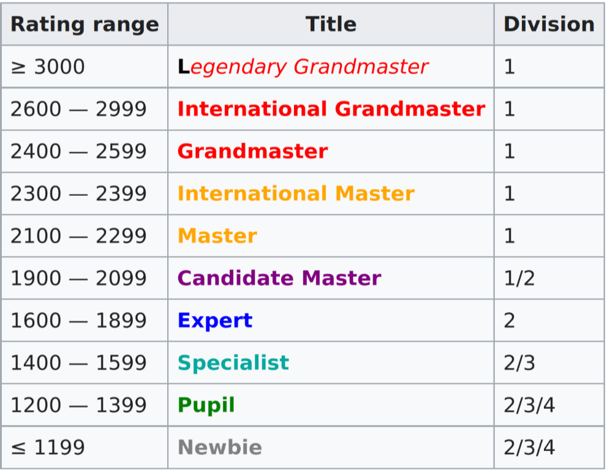

# Codeforces

<i>This section goes into detail about Codeforces, which is the most popular website for compeititve coding.</i>

## What is Codeforces?

Codeforces is a Russian competitve coding platform.

It is maintained by a team of compeititve coders from ITMO University led by Mike Mirzayanov.

It is widely regarded as the most popular platform for CC.

## User rating

Codeforces users are ranked according to their user rating.

The rating system used in Codeforces is similar to the <a href = "https://en.wikipedia.org/wiki/Elo_rating_system">Elo rating system</a> used in chess.

On the basis of rating, users are classified into different rating groups.

## Contests on Codeforces

A typical Codeforces contest typically consists of 6-8 problems.

Users are ranked on the basis of the number of problems they solve, the amount of time it took them to solve the problems, and the number of times they submitted an incorrect submission.

The exact way in which these metrics are taken into account depends on the contest.

Contests on Codeforces are primarily of four types - Division 1, Division 2, Division 3 and Division 4.

1. Division 1 contests are for users with a rating greater than or equal to 1900.</li>
2. Division 2 contests are for users with a rating below 1900.</li>
3. Division 3 contests are for users with a rating below 1600.</li>
4. Division 4 contests are for users with a rating below 1400. </li>

## Problems on Codeforces

In addition to hosting contests, Codeforces allows users to practice problems from previous ones.

Each problem on Codeforces has a 'rating' which is roughly indicative of its difficulty.

The easiest problems on Codeforces are rated 800 while the toughest are rated 3500.

Problems on Codeforces are also tagged by the topics on which they are based.

The <a href = "https://codeforces.com/problemset">Codeforces problemset</a> page allows you to sort problems by rating and the number of users that have solved it, and also filter by rating and tags.

## Problem Verdicts

After you submit your source code to a problem, the judging system will run your code for a large number of inputs (test cases) and verify if the output matches the correct output. There are various messages (verdicts) that the judging system may display:
- **Accepted (AC):**
  
  Congratulations, you've solved the problem!
  
- **Wrong Answer (WA):**
  
  Your code's output was not right for one or more test cases. You should try to debug your code to see what's going wrong.

- **Run Time Error (RTE):**
  
  Your code crashed while executing one or more test cases. You should try to debug your code by checking for situations where it might crash. 
  
- **Time Limit Exceeded (TLE):**
  
  Your code took too long to execute during one or more test cases. Your code may or may not be right and you should try to think of a more optimal solution.

- **Memory Limit Exceeded (MLE):**

  Your code consumed too much memory while executing one or more test cases. Try to think of a more memory efficient solution.

- **Compile Error (CE):**

  Your code failed to compile. You should check for syntax errors in your code.
