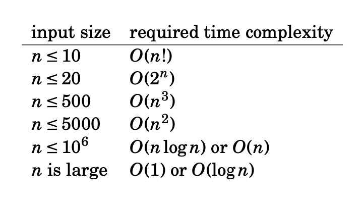

# Time Complexity

_In this section, we will discuss time complexity, the concept behind evaluating the efficiency of an algorithm._

## Big O notation

Big O notation is a mathematical notation that is used to represent how a particular function changes with respect to change in one of its independent variables. 

It shows the asymptotic behaviour of the function, which is when the independent variables tend to infinity.

Let us take the example of the function $f(x) = 5x$.

As the change in $f(x)$ is directly proportional to the change in $x$, $f(x)$ is said to be linear with respect to $x$.

The big O notation for such functions is $O(x)$.

Similarly, the big O notation for function $f(x) = 3x^2$ is $O(x^2)$.

Note that the big O notation only contains information about the power of $x$ and not the coefficients of each term.

Now, let us take the function $f(x) = x^2 + 5x$.

When a function contains multiple terms, only the term which increases fastest with respect to the independent variable is considered.

Thus, the time complexity of this function is also $O(x^2)$.

## How do I use big O notation?

Big O notation is helpful in CC as it helps determine the efficiency of an algorithm.

First, we think of the amount of time taken by an algorithm to run as a function of an input-dependent value $n$.

This function is roughly proportional to the number of operations performed by an algorithm.

Thus, if we can find out how the number of operations performed by our an algorithm scales with the input-dependent value, we can determine the time complexity of the algorithm.

For each time complexity, there is a set of input values which can execute within the time constraint.

Therefore, we must first look at the input constraints and then choose an appropriate algorithm accordingly.

A general rule-of-thumb is that an average computer can execute around $10^7$ to $10^8$ elementary operations in one second.

## Common time complexities

Let us take a look at some of the most common time complexities and examples of algorithms for each.

Don't worry about not understanding the derivation of the big O notation for each algorithm at this point, you will eventually get a hang of it as you solve CC problems.

### $O(1)$ - constant time

Adding two numbers takes constant time, as if the numbers are not extremely large, this involves a single addition operation.

### $O(log n)$ - logarithmic time

<a href = "https://en.wikipedia.org/wiki/Binary_search_algorithm">Binary search</a> takes logarithmic time, as during each step of the algorithm, the length of the array to be searched is halved.

### $O(n)$ - linear time

Finding the maximum number in an array takes linear time, as performing this task requires processing each element in the array.

### $O(n log n)$ - log-linear time

<a href = "https://en.wikipedia.org/wiki/Merge_sort">Merge sort</a>, one of the most efficient sorting algorithm, takes log-linear time. 

### $O(n^2)$ - quadratic time

The algorithm written in the previous section takes quadratic time as it consists of two nested input-dependent for loops.

### $O(2^n)$ - exponential time

A naive recursive implementation of finding a particular term in the Fibonacci sequence takes exponential time, as you need the previous two terms to calculate a specific term.

### $O(n!)$ - factorial time

An algorithm that processes every possible permutation of an array of numbers takes factorial time.

## Links to external resources

1. [Big O notation in 100 seconds](https://www.youtube.com/watch?v=g2o22C3CRfU)
2. [GeeksForGeeks article on time and space complexity](https://www.geeksforgeeks.org/time-complexity-and-space-complexity/)
3. [Sorting algorithms compared using big O notation](https://www.youtube.com/watch?v=kgBjXUE_Nwc)
4. [Big O notation for coding interviews](https://www.youtube.com/watch?v=BgLTDT03QtU)
