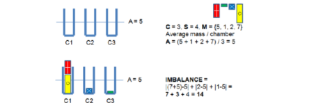
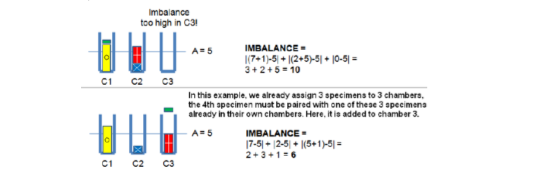
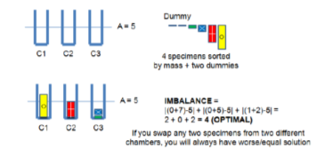

# Sorting 

## Introduction:

Sorting forms the primary subroutine to solve many problems and forms the basis for many algorithms. In fact, you would have come across many problems that you would have solved (without realizing) using sorting. 

Some of the basic yet very hard to compute; questions that arise when we deal with an array of data can be answered by preprocessing the data first by sorting. 

Given an array of numbers, questions like "What is the largest number in the set that is $\le k$ for some integer $k$?" or "What is the most frequent number in the array?" can be answered by initially preprocessing the array by sorting.

There are many sorting algorithms and they are classified on the basis of time complexity.

0. $O(n^2)$ comparision based algorithms:
   
    Some examples of this are bubble, selection and insertion sort. These are often quite slow and are not usable in most problems and are avoided. However, a rudimentary understanding on their working principle does help in a few problems.

1. $O(n \log(n))$ comparison based algorithms:
   
   Some examples of this are merge, quick and heap sort. These algorithms are the default choice in programming contests as the time complexity is optimal for comparison-based sorting. Therefore, these sorting algorithms run in the ‘best possible’ time in most cases.

   To avoid reinventing the wheel, we use the STL implementation of these using `sort`, `stable_sort` or `partial_sort` in  C++, `Collections.sort` in Java or `sorted(list_name)` in Python.
   
   Watch the video on merge sort in `Sorting Algorithms` and `Technique Analysis` to understand how C++ STL sorts data.

3. $O(n)$ special purpose algorithms:
   
    Counting, radix and bucket sort are a few examples. Although not as generic as the others, these special purpose algorithms can reduce the required sorting time if the data has certain special characteristics.

Additionally, you can use the links below for a better understanding by visualizing these algorithms : 
- [Sorting Algorithms](https://www.youtube.com/watch?feature=shared&v=WaNLJf8xzC4)
- [Technique Analysis](https://youtube.com/playlist?list=PL2ONYsvCDiDsQ2AwqRxh0EE6AKm4jW7hp&feature=shared)
- [Sort Visualization ](https://visualgo.net/en/sorting)

<br>

## C++ Implementation:

Sorting can be done on arrays or any sequence container like vectors and deques.

The C++ function for sort is `std::sort` and it runs in $O(n\log(n))$.

- On arrays, it is called as:

```cpp
// For an array 'a' of length 'n'

sort(a, a + n);  // ascending order

sort(a, a + n, greater<int>());  // descending order
```

- On sequence containers, it can be done as:

```cpp

sort(v.begin(), v.end());  //sort vector 'v' in ascending order

sort(dq.begin(), dq.end(), greater<int>());  //sort deque 'dq' in descending order

```

- Custom comparators:

Sorting can also be done using customised sorting rules according to various problem requirements. These arbitary comparision rules are incorporated using custom comparator functions. 

Assume that we need to sort a vector `v` of pairs $(x, y)$ in descending order of the value of $x^3 - y^2$:

```cpp
bool comp(pair<int,int> a, pair<int,int> b)
{
    int x = pow(a.first, 3), y = pow(a.second, 2);
    int p = pow(b.first, 3), q = pow(b.second, 2);

    if((x - y) > (p - q)) return true; //place a before b
    else return false; //place a after b
}

...

void solve()
{
  ...
  sort(v.begin(), v.end(), comp);
  ...
}

``` 

When you write a comparator `bool cmp(a, b)`, return true if you want a to be before b in the sorted list and false if you want b to be before a in the sorted list.

As this rather (in)famous [CF blogpost](https://codeforces.com/blog/entry/70237) points out, `cmp` must return false when `a = b` (failing to do this can make your operator non-transitive in certain situations, leading to runtime errors and veery weird side effects).

Alternatively, we can use anonymous 'lambda' functions to do the same in a more concise format:

```cpp
// we can take advantage of type inference and use `auto` instead of mentioning the actual data type
// this snippet sorts a vector of pairs (x, y) in ascending order of x * y
sort(v.begin(), v.end(), [] (auto a, auto b) {
  return a.first * a.second < b.first * b.second;
});
``` 

PS: While this is what most people use lambda functions for, they are far more powerful and versatile. Their conciseness and variable capturing means that they can be used instead of regular functions most of the time, except that you can declare them inside normal / lambda functions. This can simplify variable scope management for slightly more complicated CC problems and is slightly more efficient. (perhaps a topic for a future doc?)

<br>

# Greedy Algorithms

## Introduction:

Greedy algorithms are exactly what they sound like - they exploit certain properties of the given problem that optimise the computation of the result by eliminating or minimizing the simulation process. Since greedy algorithms are mostly problem-specific and aren't particularly classified into typical cases, we will explore some illustrations to understand the concept of greedy algorithms.

There are usually two common traits in most greedy problems exhibit:
- It has optimal substructures (the optimal solution to the problem contains the optimal solution to all sub-structures)
- It has a greedy property (the globally optimal solution can be made by making a locally optimal choice)

Sometimes, it can be quite difficult to prove the absolute validity of the greedy solution and so you have to rely on a mix of intuition, sample tests and edge cases you've thought about. However, eventually this process will start to feel more natural as your intuition develops with practice.


<br>

## Example 0 - [Station Balance](https://onlinejudge.org/index.php?option=onlinejudge&Itemid=8&page=show_problem&problem=351):



How would you go about this problem? Simulate all the possible options? In the worst case scenario, you have C = 5 and S = 10, which would give you around $45^5  \approxeq 10^9$ possible combinations, which is sure to exceed the time limit for this problem.



Let's make a few observations:

- If there exists an empty chamber, it is usually beneficial and **never worse** to move one specimen from a chamber with two specimens to an empty chamber! Otherwise, the empty chamber contributes more to the imbalance (see fig 2 top).

- If $S \gt C$, then $S - C$ specimens must be paired with a chamber already containing other specimens — the pigeonhole principle! (see fig 2 bottom)

The key insight is that the solution to this problem can be simplified with sorting: if  $S \lt 2C$ , add $2C - S$ dummy specimens with mass 0. For example, C = 3, S = 4, M = {5, 1, 2, 7} $\rightarrow$ C = 3, S = 6, M = {5, 1, 2, 7, 0, 0}. 

Then, sort the specimens on their mass such that $M_1 \leq M_2 \leq .. . \leq M_{2C-1} \leq M_{2C}$.

In this example, M = {5, 1, 2, 7, 0, 0}  $\rightarrow$  {0, 0, 1, 2, 5, 7} . By adding dummy specimens and then sorting them, a greedy strategy becomes ‘apparent’:

- Pair the specimens with masses M_1 & M_{2C} and put them in chamber 1, then
- Pair the specimens with masses M_2 & M_{2C-1} and put them in chamber 2, and so on .. .

This greedy algorithm - commonly called 'load balancing' - works for this problem!



Designing greedy algorithms is an art and it is hard to impart the techniques used to deriving greedy solutions. However, one of the best ways to get started if you think that there exists a greedy solution is to sort the data in some fasion and then compute the required terms to see if some greedy strategy emerges. 

Two common ways to prove greedy algorithms are to prove that "greedy stays ahead" (the greedy strategy is never worse than the optimal strategy at any point) and exchange arguments (exchanging two elements with certain properties always makes the answer better / worse).

It is also true that greedy strategies often fail to provide complete solutions to a broader testcases. We will explore an example of the same in the next illustration.

<br>

## Example 1 - Coin Change:

Problem description: 

We are given a target amount $V$ cents and a list of denominations of $n$ coins, i.e., we have $coin_i$ (in cents) for coin types $i \epsilon [0..n-1]$. 
What is the minimum number of coins that we must use to represent amount $V$? Assume that we have an unlimited supply of coins of any type. 

Example: 

`If n = 4, coinValue = {25, 10, 5, 1} cents and we want to represent V = 42 cents.`

We can use this greedy algorithm: repeatedly select the largest coin denomination which is not greater than the remaining amount, i.e., 42 - 25 = 17 $\rightarrow$ 17 - 10 = 7 $\rightarrow$ 7 - 5 = 2 $\rightarrow$ 2 - 1 = 1 $\rightarrow$ 1 - 1 = 0, a total of 5 coins. This is optimal.

The problem above has the two ingredients required for a successful greedy algorithm:

- It has optimal sub-structures.
  We have seen that in our quest to represent 42 cents, we use 25 + 10 + 5 + 1 + 1 . This is an optimal 5-coin solution to the original problem!
  Optimal solutions to sub-problem are contained within the 5-coin solution, i.e.,
  a. To represent 17 cents, we use 10 + 5 + 1 + 1 (part of the solution for 42 cents),
  b. To represent 7 cents, we use 5 + 1 + 1 (also part of the solution for 42 cents), etc.
  
- It has the greedy property:
   Given every amount V,we can greedily subtract V with the largest coin denomination which is not greater than this amount V.
   It can be proven (not shown here for brevity) that using any other strategies will not lead to an optimal solution for this set of coin denominations.
  
However, this greedy algorithm does not work for all sets of coin denominations. Take for example {4, 3, 1} cents. To make 6 cents with that set, a greedy algorithm would choose 3 coins {4, 1, 1} instead of the optimal solution that uses 2 coins {3, 3}.

The complete solution to this problem will be dealt with in further weeks when we will discuss another more powerful problem solving paradigm - dynamic programming.

<br>

## Example 2 - [Dragons of Loowater](https://open.kattis.com/problems/loowater):

There are several ways to solve this problem, but we will illustrate one of the easiest. This problem is a bipartite matching problem, in the sense that we are required to match (pair) knights to dragons in a minimal cost way.

We shall try to develop a greedy algorithm for this: a dragon head with a certain diameter $D$ should be chopped by a knight with the shortest height $H$ such that $D \leq H$.

However, the input is given in an arbitrary order. This is frequently done by the problem authors to mask the greedy strategy. If we sort both the array of dragon head diameters head and knight heights height in $O(n \log n + m \log m)$, we can use the following $O(max(n,m))$ scan to determine the answer. This is yet another example where sorting the input can help produce the required greedy strategy.

```cpp
sort(D.begin(), D.end()); 
sort(H.begin(), H.end());

int gold = 0, d = 0, k = 0;

while ((d < n) && (k < m))            //while not done yet
{
     while ((k < m) && (D[d] > H[k]))
 	++k;			       //find required knight
     if (k == m) break;               //loowater is doomed
     gold += H[k];		      //pay this amount of gold
     ++d; ++k;			      //next dragon & knight
}

if (d == n) cout << gold << "\n";
else cout << "loowater is doomed" << "\n";

```

<br>

# Problems on Greedy and Sorting Algorithms

1. Warmup:
   - [Cow Tipping](http://www.usaco.org/index.php?page=viewproblem2&cpid=689)
   - [Amr and Music](https://codeforces.com/problemset/problem/507/A)
   - [Middle Class](https://codeforces.com/problemset/problem/1334/B)
   - [Elephants](https://onlinejudge.org/index.php?option=onlinejudge&Itemid=8&page=show_problem&problem=5020)

2. Sorting and Greedy:
   - [Too Many Segments](https://codeforces.com/contest/1249/problem/D2)
   - [Olya and Game with Arrays](https://codeforces.com/problemset/problem/1859/B)
   - [Similar Pairs](https://codeforces.com/problemset/problem/1334/B)
   - [Moamen and k-subarrays](https://codeforces.com/problemset/problem/1557/B)
   - [ICPC Team Selection](https://open.kattis.com/problems/icpcteamselection)

3. Classic and Not so Classic Greedy Problems (Core Workout):
   - [Carnival Tickets](https://oj.uz/problem/view/IOI20_tickets)
   - [Alien DNA](https://onlinejudge.org/index.php?option=onlinejudge&Itemid=8&page=show_problem&problem=2630P)
   - [Teacher Evaluation](https://open.kattis.com/problems/teacherevaluation)
   - [Hippo Circus](https://onlinejudge.org/index.php?option=onlinejudge&Itemid=8&page=show_problem&problem=4952)
   - [Square Pegs in a Circular Hole](https://open.kattis.com/problems/squarepegs)
     
4. [CSES Problemset - Sorting and Searching](https://cses.fi/problemset/list/)
