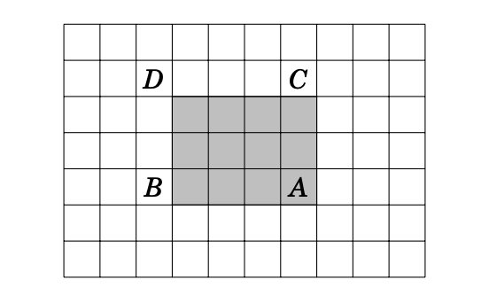

# Prefix Sums

Prefix sums is a very useful technique for computing static range queries on arrays (a value that can be calculated for a subarray of an array where the elements are not updated).

Let's understand it using the classic problem prefix sums tries to solve: static range sum queries.

<br>

## Subarray Sums

You have an array of $n$ elements: $a_1, a_2, ..., a_n$. You have to answer $q$ queries: given $l_j$ and $r_j$ ($1 \le j \le q$), what is the sum of all the array elements from index $l_j$ to index $r_j$ (both inclusive)?

The obvious approach would be to use a `for` loop for each query:
```cpp
for (int i = 0; i < q; i++)
{
    int l, r;
    cin >> l >> r;
    int sum = 0;
    for (int j = l; j <= r; j++)
        sum += a[j];
    cout << sum << "\n";
}
```

For the time complexity, we see that the inner loop takes $r - l$ iterations per query, which can be $n$ in the worst case. Since the outer loop runs $q$ times, the overall time complexity is $O(q \cdot n)$.

While this is fine for small $q$, when $q$ is comparable to $n$, it becomes rather inefficient. Let's think of a way to speed this up with some precomputation.

Observe that:

$$ \sum_{i=l}^r a_i = \sum_{i=1}^r a_i - \sum_{i=1}^{l - 1} a_i $$

We define the prefix sum function $p_i$ as the sum of the array elements from the starting index till index $i$:

$$ p_i = \sum_{j=1}^i  a_j $$

Notice that if we can calculate this function for all indices, we can find the sum of any subarray just by subtracting (we assume p_0 = 0 to simplify things):

$$ \sum_{i=l}^r a_i = p_r - p_{l - 1} $$ 

While it might seem like we still need to use a `for` loop for each calculation of $p_i$, we actually don't:

$$ p_1 = a_1 $$

$$ p_i = p_{i - 1} + a_i $$

This means we can use just one `for` loop to calculate all the prefix sum values and then subtract the appropriate values for answering the queries.

```cpp
void solve() {
    int n;
    cin >> n;
    vector <int> a(n + 1);
    for (int i = 1; i <= n; i++) 
        cin >> arr[i];

    vector <int> p(n + 1);
    p[1] = a[1];
    for (int i = 2; i <= n; i++)
        p[i] = p[i - 1] + a[i];

    int q;
    cin >> q;
    for (int i = 0; i < q; i++)
    {
        int l, r;
        cin >> l >> r;
        cout << p[r] - (l == 1 ? 0 : p[l - 1]) << "\n";
    }
}
```

For the time complexity, computing the prefix sums is $O(n)$ and we answer each of the $q$ queries in $O(1)$, giving us $O(n + q)$, which is must faster.

<br>

## 2-D Prefix Sums:

Consider the 2-D variant of this problem: given a 2-D array $a_{ij}$ $(1 \le i \le n, 1 \le j \le m)$, answer $q$ queries of the sum of rectanglular subarray formed by $i = x_1, i = x_2, j = y_1$ and $j = y_2$ $(x_1 \le x_2, y_1 \le y_2)$.

Let's define our prefix function as the sum of the subarray formed by $(1, 1)$ and $(i, j)$:

$$ p(i, j) = \sum_{x=1}^i \sum_{y=1}^j a_{ij} $$

To answer the query, we can think geometrically and use some inclusion-exclusion intuition:



$$ S = p(x_2, y_2) - p(x_2, y_1 - 1) - p(x_1 - 1, y_2) + p(x_1 - 1, y_1 - 1) $$

To calculate the values of the prefix sum function, we first do the prefix sums rowwise and then columnwise (or vice versa):

```cpp
void solve() {
    int n, m;
    cin >> n >> m;
    vector<int> a(n + 1, vector<int>(m + 1));
    for (int i = 1; i <= n; i++)
    {
        for (int j = 1; j <= m; j++)
        {
            cin >> a[i][j];
        }
    }

    vector<int> p(n + 1, vector<int>(m + 1));
    for (int i = 1; i <= n; i++)
    {
        p[i][1] = a[i][1];
        for (int j = 2; j <= m; j++)
        {
            p[i][j] = p[i][j - 1] +  a[i][j];
        }
    }
    for (int j = 1; j <= m; j++)
    {
        for (int i = 2; i <= n; i++)
        {
            p[i][j] += p[i - 1][j];
        }
    }

    int q;
    cin >> q;
    for (int i = 0; i < q; i++)
    {
        int x1, x2, y1, y2;
        cin >> x1 >> x2 >> y1 >> y2;
        int ans = p[x2][y2];
        if (x1 > 1) ans -= p[x1 - 1][y2];
        if (y1 > 1) ans -=  p[x2][y1 - 1];
        if (x1 > 1 && y1 > 1) ans += p[x1 - 1][y1 - 1];
        cout << ans << "\n";
    }
}
```

Challenge: can you think of how you would implement 3-D prefix sums? What about n-D prefix sums?

<br>

## Extending Prefix Sums

Even thought the most common application is with range sums, this type of 'prefix precomputation' can be applied to a number of operations like multiplication or XOR. 

Consider the problem of finding the range query values of some binary operator $\ast$ on the subarray $[l, r]$:

$$ Q(l, r) = a_l \ast ... \ast a_r $$

The prefix function $p$ is:

$$ p(i) = a_1 \ast ... \ast a_i $$

For the queries, let $\circ$ be the inverse operator of $\ast$:

$$ Q(l, r) = p(r) \circ p(l - 1) $$

As you can see, this method works for any binary operator $\ast$ that is associative and has an inverse (if the inverse does not exist, we can only answer queries with $l = 1$).

The main drawback of this technique is that it does not support update operations on the array (dynamic range queries). However, more advanced data structures like segment trees and Fenwick trees can be used in such cases.

<br>

## Problems:

- [Static Range Sum Queries](https://cses.fi/problemset/task/1646)
- [Forest Queries](https://cses.fi/problemset/task/1652)
- [Range Xor Queries](https://cses.fi/problemset/task/1650)
- [Maximum Subarray Sum](https://cses.fi/problemset/task/1643)
- [Subarray Sums II](https://cses.fi/problemset/task/1661)
- [1398C - Good Subarrays](https://codeforces.com/contest/1398/problem/C)
- [313B - Ilya and Queries](https://codeforces.com/problemset/problem/313/B)
- [433B - Kuriyama Mirai's Stones](https://codeforces.com/problemset/problem/433/B)
