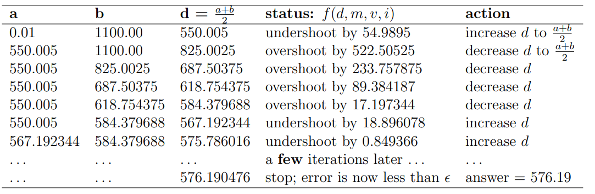

# Binary Search

## Introduction

Divide and Conquer (D&C) is a problem-solving paradigm in which a problem is made simpler by ‘dividing’ it into smaller parts and then conquering each part. The steps:

1. Divide the original problem into sub-problems—usually by half or nearly half,
2. Find (sub)-solutions for each of these sub-problems—which are now easier,
3. If needed, combine the sub-solutions to get a complete solution for the main problem.

You have learnt in the previous weeks about a few divide and conquer techniques. $O(n \log n) $ Sorting algorithms like merge sort, heap sort etc work on this principle. Data structures like `set` use D&C methods to store date. However, the most common use of it is binary search.

<br>

## Standard Usage
   
Binary search refers to searching for an element in a sorted array by repeatedly splitting it into halves and referring to the middle element. Consider an array sorted in ascending order. The following code can be used to search for an element in the array.
    
```cpp
while (l <= r)
{
    mid = (l + r) / 2;
    if (arr[mid] == x) 
        cout << "Found!" << "\n";
    if (x < arr[mid]) 
        r = mid - 1;
    if (x > arr[mid]) 
        l = mid + 1;
}
```

Notice how the left and right limits of the search range are dynamically changed to narrow down on the element we want to search.

We check the middle of the sorted array to determine if it contains what we are looking for. If it is or there are no more items to consider (l > r), we stop. 

Otherwise, we can decide whether the answer is to the left or right of the middle element and continue searching. If `x` is smaller than the middle element, it will obviously be smaller than everything in the left half (because it's in ascending order) and so we can update `l` to ignore that part.

As the size of search space is halved (in binary fashion) after each check, we can see that:

$$ 2^{ops} \approx n $$ 

This means that its time complexity is $O(log n)$.

(If you're curious about analysing divide and conquer time complexities in general, read up on the [master theorem](https://en.wikipedia.org/wiki/Master_theorem_(analysis_of_algorithms)))

As mentioned before, two C++ STL functions `lower_bound` and `upper_bound` are very useful in this context and will save you the effort of implementing the binary search.

- `lower_bound(start_ptr, end_ptr, num)`:
  
  Returns a pointer to the first position of a number greater than or equal to num

- `upper_bound(start_ptr, end_ptr, num)`:

  Returns a pointer to the first position of a number strictly greater than num

The `start_ptr` variable holds the starting point of the binary search and `end_ptr` holds the ending position of binary search space and `num` is the value to be found.

To get the actual index, just subtract the first position i.e `vec.begin()` from the pointer.

While this method is quite useful on its own, it becomes very powerful when extended in general.

<br>

## Bisection Method

The binary search principle can be extended to compute the root of a function (its zero) **as long as it is monotonic**. 

Assume you are taking a loan of $x$ rupees from the bank at an interest rate of $i$ % for $m$ months. You need to compute the installment $d$ that you need to pay per month such that the loan is payed in the given time. 

The bank charges interst on the unpaid loan at the end of each month. In short, you need to compute $d$ such that $f(d) \approx 0$ for given $x$, $m$ and $i$.

Let us take an example with $m$ = 2 months, $x$ = 1000 rupees and $i$ = 10%.

An easy way to solve this root finding problem is to use the bisection method.

We pick a reasonable range as a starting point. We want to find $d$ within the range $[a, b]$ where $a = 0.01$ (we have to pay at least one paisa) and $b = (1 + \frac{i}{100}) * x$ (the earliest we can complete is $m = 1$ if we pay exactly $(1 + \frac{i}{100}) * x$ rupees after one month. In this example, $b = (1 + 0.1) * 1000 = 1100.00$ rupees.



Notice that bisection method only requires $O(log((b-a)/\epsilon))$ iterations to get an answer with error smaller than $\epsilon$. In this example, bisection method only takes $log(1099.99/\epsilon)$ tries, which is only 40 iterations for $\epsilon = 10^{-9}$ , this yields only $\approxeq$ 40 iterations, which is incomprehensibly faster than the brute force solution.

However, this is still not the most general form of binary search.

<br>

## Binary Search on Answer

Consider a boolean function $f: {l, l + 1, ... r} \rightarrow {0, 1}$ that is monotonous on $[l, r]$, that is:

$$ f(l) \le f(l + 1) \le ... \le f(r) $$

or

$$ f(l) \ge f(l + 1) \ge ... \ge f(r) $$

Binary search finds the unique index $x$ such that $f(x) = f(l)$ and $f(x + 1) = f(r)$ or reports that it does not exist.

The time complexity will be $O(T * (r - l))$ where $T$ is the time complexity of the function $f$. This means that we can use binary search for **finding the changing point of any monotonous function we define**. 

This can be very useful for certain problems where checking if a solution is valid is easy but finding the solution with a specific property is much harder (as long as the associated boolean function is monotonic). 

We can take the initial range $[l, r]$ as the range of all possible solutions and run our binary search by checking if the current solution is valid:

```cpp
// This finds the first index on [l, r] at which `f` is true
ll ans = r + 1;
while (l <= r)
{
        ll mid = (l + r) / 2;
        if (f(mid))
        {
                ans = mid;
                r = mid - 1;
        }
        else
        {
                l = mid + 1;
        }
}
cout << ans << "\n";
```

To make things clear, let's look at an example.

<br>

## Array Division

Given an array of positive integers $a_1, a_2...a_n$, divide it into $k$ subarrays such that the maximum sum of a subarray is as small as possible.

On its own, this type of minimising the maximum along with the partitions seems pretty hard to solve using normal methods. 

Let us think of the related checking problem: given a value $x$, can you divide array $a$ into $k$ subarrays such that the maximum sum of a subarray is atmost $x$?

Note that this would mean that all subarray would have to have sum less than $x$. This means we can use a greedy strategy: greedily extend the current subarray as long as its sum is atmost $x$ and start a new subarray once it exceeds $x$. 

Finally, we will check if the number of subarrays created is atmost $k$ to see if using $x$ as the solution is valid or not. This will have time complexity $O(n)$.

(Note that having fewer partitions is never a problem, we can always split it up more and the sum will still never cross $k$)

Now, we can binary search on the answer $x$ since if $x$ is a valid solution, any $y \gt x$ is also a valid solution (if the maximum sum of a subarray is less than $x$, then clearly it is less than $y$ as well), which means it is monotonic.

The total time complexity will be $O(n * log (MAXSUM))$.

<details>

<summary><b>Implementation</b></summary>

```cpp
#include <bits/stdc++.h>
using namespace std;
typedef long long ll;

bool f(const vector<ll> &arr, const ll k, ll maxsum) 
{
	ll count = 0;
	ll cur = 0;

	for (auto &i : arr) 
  	{
    		if (i > maxsum)
     	 		return false;
		if (cur + i > maxsum) 
		{
			count++;
			cur = 0;
		}
		cur += i;
	}

	if (cur > 0) 
    		count++;

	return count <= k;
}


int main() 
{
	ll n, k;
	cin >> n >> k;

	vector<ll> arr(n);
	for (ll &i : arr) 
		cin >> i;

	ll l = 0, r = 3e14;

	ll ans = r + 1;
	while (l <= r)
  	{
    		ll mid = (l + r) / 2;
    		if (f(arr, k, mid))
    		{	
      			ans = mid;
      			r = mid - 1;
    		}
    		else
    		{
      			l = mid + 1;
    		}
  	}
  	cout << ans << "\n";
  	return 0;
}
```

</details>

<br>

## Problems

A great resource for binary search in general is the Codeforces EDU course.

**1. Workout Prep:**
  -  [Binary Search](https://leetcode.com/problems/binary-search)
  -  [Search Insert Position](https://leetcode.com/problems/search-insert-position/)
  -  [Sum of Two Values](https://cses.fi/problemset/task/1640)
  -  [Sum of Three Values](https://cses.fi/problemset/task/1641)

**2. Warmup:**
  - [Firefly](https://open.kattis.com/problems/firefly)
  - [Room Painting](https://open.kattis.com/problems/roompainting) [hint : use `lower_bound`]
  - [Out of Sorts](https://open.kattis.com/problems/outofsorts)
  - [Fibonaccharsis](https://codeforces.com/problemset/problem/1853/B)
  - [Search a 2D Matrix II](https://leetcode.com/problems/search-a-2d-matrix-ii/)
  - [Valid Perfect Square](https://leetcode.com/problems/valid-perfect-square/)
  - [Subarray Sums II](https://cses.fi/problemset/task/1661)
    
**3. Core Workout:**
  - [Vika and the Bridge](https://codeforces.com/problemset/problem/1848/B)
  - [XOR Partition](https://codeforces.com/problemset/problem/1849/F)
  - [Toy Blocks](https://codeforces.com/problemset/problem/1452/B)
  - [Sage's Birthday](https://codeforces.com/problemset/problem/1419/D2)
  - [Keshi Is Throwing a Party](https://codeforces.com/problemset/problem/1610/C)
  - [Dubious Cyrpto](https://codeforces.com/problemset/problem/1379/B)
  - [Subarray Divisibility](https://cses.fi/problemset/task/1662)
  - [Array Division](https://cses.fi/problemset/task/1085)

<br>
