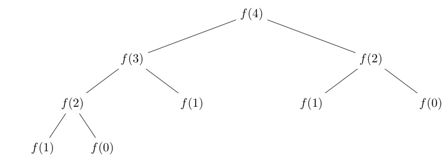
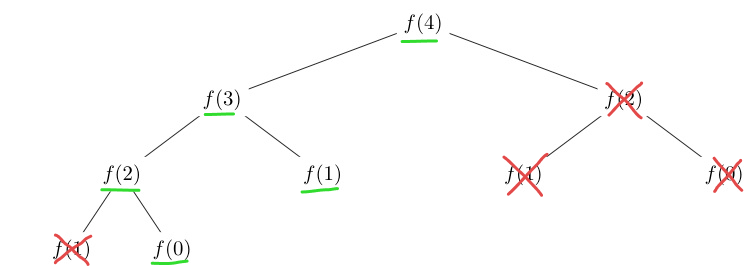

# Dynamic Programming

## Introduction

<p>Dynamic programming is a technique of solving problems that involves dividing the larger problem into smaller sub-problems that can be solved independently.</p>
<p>Dynamic programming is generally used in two cases:</p>

<ul>
<li>Finding the most optimal solution</li>
<li>Finding the number of solutions</li>
</ul>

<p>Before we look at how dynamic programming works, we first need to look at the underlying trick that makes dynamic programming quick - memoisation.</p>

## Memoisation

### Regular recursion - is it efficient?

<p>In dynamic programming, we make use of recursion - for example, we could express the solution for the case when <code>n = k</code> in terms of the solutions to cases when <code>n < k</code>.</p>
<p>As an example, let us consider the problem of computing the <code>n<sup>th</sup></code> (0-based indexing) term in the Fibonacci sequence.</p>
<p><code>fib (n)</code> can be expressed as <code>fib (n - 1) + fib (n - 2)</code>.</p>
<p>We define the base cases <code>fib (0) = 1</code> and <code>fib (1) = 1</code> separately.</p>
<p>Let us implement this logic using recursion.</p>

<details>
<summary><b>C++ Implementation</b></summary>

```cpp
void fib (int k) {
    if (k == 0 || k == 1) return 1;
    else return fib (k - 1) + fib (k - 2);
}
```

</details>

<details>
<summary><b>Python Implementation</b></summary>

```py
def fib (k):
    if k == 0 or k == 1:
        return 1
    else:
        return fib (k - 1) + fib (k - 2)
```

</details>

<p>Every time we call the function <code>fib</code>, we re-call it twice, creating a tree of recursive <code>fib</code> calls until the base cases <code>fib (0)</code> and <code>fib (1)</code> are reached.</p>
<p>In the case of computing <code>fib (4)</code>, the tree looks something like this.</p>



The main thing to notice is that the tree gets exponentially bigger with every increase in $n$, which shows that this algorithm has a time complexity of $O (2 ^ n)$.

However, we can improve the algorithm to work in $O (n)$ complexity.

### Recursion powered by memoisation

<p>If you look at the tree, you will notice that several function calls are identical.</p>
<p>For example, <code>fib (2)</code> is called twice.</p>
<p>If we could somehow save the values of the function calls, we would end up massively reducing the time taken by the algorithm.</p>
<p>Let us create an array <code>arr</code> where <code>arr [i]</code> stores the value of <code>fib (i)</code>.</p>
<p>The values in <code>arr</code> are initialised to <code>-1</code>, indicating that no values have been computed yet.</p>
<p>The function <code>fib (k)</code> is only called when <code>arr [k] = -1</code>, otherwise, the value of <code>arr [k]</code> is directly used.</p>
<p>This prevents us from making redundant function calls when we already know the answer.</p>

<details>
<summary><b>C++ Implementation</b></summary>

```cpp
int arr [n + 1];
for (int i = 0; i <= n; i ++) 
    arr [i] = -1;

void fib (int k) {
    if (k == 0 || k == 1) return 1;
    else {
        if (arr[k] == -1) 
            arr[k] = fib (k - 1) + fib (k - 2);
        return arr[k];
    }
}
```

</details>

<details>
<summary><b>Python Implementation</b></summary>

```py
arr = []
for i in range (n + 1):
    arr.append (-1)

def fib (k):
    if k == 0 or k == 1:
        return 1
    else:
        if (arr[k] == -1) 
            arr[k] = fib (k - 1) + fib (k - 2)
        return arr[k]
```

</details>

<p>Let us now examine the time complexity of our new algorithm.</p>
<p>Here is the function call tree in the case of memoisation.</p>



As you can see, the number of function calls is now the same as the index of the term that we are looking for - making the time complexity $O (n)$, which is much better than the $O (2 ^ n)$ time complexity without memoisation.

### Do we really need recursion?

<p>Now that we are using memoisation, it turns out that we do not need to use recursion.</p>
<p>We can simply build <code>arr</code> iteratively, term-by-term, with each term being constructed from its preceding two terms.</p>
<p>Of course, we need to initialise <code>arr [0]</code> and <code>arr [1]</code> before we begin iterating.</p>

<details>
<summary><b>C++ Implementation</b></summary>

```cpp
int arr [n + 1];
arr [0] = 1;
arr [1] = 1;
for (int i = 2; i <= n; i ++) 
    arr [i] = arr [i - 1] + arr [i - 2];
```

</details>

<details>
<summary><b>Python Implementation</b></summary>

```py
arr = []
arr.append (0)
arr.append (1)
for i in range (2, n + 1):
    arr.append (arr [i - 1] + arr [i - 2])
```

</details>

The approach that involves recursion with memoization is usually called top-down dynamic programming (recursive DP) while the iterative solution is usually called bottom-up dynamic programming (iterative DP).

While the time complexities of both approaches should be the same if implemented correctly, bottom-up is usually more efficient since there is much less function call overhead due to the abssence of recursion. 

However, in more complicated problems, the bottom up solution can be harder to think of since you need to guarantee that all the subproblems a particular state depends on have been computed **before** we compute the answer for the current state.

## Minimum number of notes required to reach a certain amount

The problem is to find what is the minimum number of Indian Rupee notes (and coins) required to reach a certain amount $x$.

<p>As we know, Indian Rupee notes and coins come in the following denominations - <code>1</code>, <code>2</code>, <code>5</code>, <code>10</code>, <code>20</code>, <code>50</code>, <code>100</code> and <code>500</code>.

### The greedy approach - does it really work?

<p>It turns out that in this case, the problem can be solved greedily - keep picking the note with the largest possible denomination as long as the total sum in your hand is less than <code>x</code>.</p>
<p>Once the total sum becomes <code>x</code>, you have your answer.</p>

<details>
<summary><b>C++ Implementation</b></summary>

```cpp
void solve () {
    int x;
    cin >> x;
    int result = 0, rupees [8] = {1, 2, 5, 10, 20, 50, 100, 500};
    while (x > 0) {
        for (int i = 7; i >= 0; i --) {
            if (rupees [i] <= x) {
                x -= rupees [i];
                result ++;
                break;
            }
        }
    }
    cout << result << '\n';
}
```

</details>

<details>
<summary><b>Python Implementation</b></summary>

```py
def solve ():
    x = int (input ())
    result = 0
    rupees = [1, 2, 5, 10, 20, 50, 100, 500]
    while x > 0:
        for denum in rupees [ : : -1]:
            if (denum <= x):
                x -= denum
                result += 1
                break
    print (result)
```

</details>

<p>But, will this algorithm work for every set of denominations of money?</p>
<p>It turns out that the greedy algorithm does not always work.</p>
<p>Let us say that a hypothetical country has only three denominations of money - <code>1</code>, <code>3</code>, and <code>4</code>.</p>
<p>If we require a sum <code>x = 6</code>, the greedy algorithm would give us an answer of <code>4</code>, <code>1</code>, and <code>1</code> - which means that the minimum number of notes required according to our greedy algorithm is 3.</p>
<p>However, this is not the best solution, as by taking two <code>3</code> notes we get the required sum using just 2 notes.</p>
<p>Now that we have shown that the greedy approach does not always work, let us solve this problem by dynamic programming.</p>

### The correct approach using dynamic programming

<p>Let us say that the function <code>f (x)</code> returns the minimum number of notes required to obtain a sum <code>x</code>.</p>
<p>The key to solving the problem using DP is to express <code>f (x)</code> recursively.</p>
<p>How do we do this?</p>
<p>We know that a sum <code>x</code> can be reached in only three ways - by adding <code>1</code> to <code>x - 1</code>, by adding <code>3</code> to <code>x - 3</code>, or by adding <code>4</code> to <code>x - 4</code>.</p>
<p>Therefore, we can state that <code>f (x)</code> is equal to <code>1</code> added to the minimum among <code>f (x - 1)</code>, <code>f (x - 3)</code>, and <code>f (x - 4)</code>.</p>
<p>We can define an array <code>dp</code> such that <code>dp [x]</code> stores the value of <code>f (x)</code>.</p>
<p>First, we will define the base case <code>dp [0] = 0</code>, as <code>0</code> notes are required to reach a sum of <code>0</code>.</p>
<p>We then find <code>dp [i]</code> for further values of <code>i</code> iteratively, using the relation <code>dp [i] = 1 + min (dp [i - a<sub>1</sub>], dp [i - a<sub>2</sub>], dp [i - a<sub>3</sub>]), ... dp [i - a<sub>n</sub>])</code>, where <code>a</code> denotes the set of all available denominations.</p>
<p>Note that <code>dp [i - a<sub>j</sub>]</code> should only be considered while calculating the minimum when <code>i - a<sub>j</sub></code> is non-negative, as a sum can never be obtained from a negative one.</p>

<details>
<summary><b>C++ Implementation</b></summary>

```cpp
void solve () {
    int n, x;
    cin >> n >> x;
    int arr [n];
    for (int i = 0; i < n; i ++) 
        cin >> arr [i];
    int dp [x + 1];
    dp [0] = 0;
    for (int i = 1; i <= x; i ++) {
        dp [i] = -1;
        for (auto ele : arr) {
            if (i - ele >= 0) {
                if (dp [i] == -1 || dp [i - ele] + 1 < dp [i]) 
                    dp [i] = dp [i - ele] + 1;
            }
        }
    }
    cout << dp [x] << '\n';
}
```

</details>

<details>
<summary><b>Python Implementation</b></summary>

```py
def solve ():
    n, x = tuple (map (int, input ().split (' ')))
    arr = tuple (map (int, input ().split (' ')))
    dp = []
    dp.append (0)
    for i in range (1, x + 1):
        dp.append (-1)
        for ele in arr:
            if i - ele >= 0:
                if dp [i] == -1 or dp [i - ele] + 1 < dp [i]:
                    dp [i] = dp [i - ele] + 1
    print (dp [x])
```

</details>

## Multidimensional DP
In many problems, the recurrence depends on more than one variable, giving rise to multidimensional DP.

As an example, consider this problem: given an $n \times n$ grid with `.` indicating a free square and `*` indicated a blocked square, how many paths from the upper-left square to the bottom-right square do not pass through any blocked squares if you can only move right or down?

Let us take `dp[x][y]` to be the number of required paths from the upper-left square `(0, 0)` to `n(x, y)` (which means that `dp[n - 1][n - 1]` will be the final answer). Now, there are two ways to reach `(x, y)`: move left from `(x - 1, y)` or move down from `(x, y - 1)`.

However, if `(x, y)` is a blocked square, `dp[x][y]` should be zero (we cannot move to a blocked square). Combining this, we get:

$$ \texttt{dp}[x][y] =
\begin{cases}
\texttt{dp}[x-1][y] + \texttt{dp}[x][y-1] & \text{if $(x, y)$ is blocked} \\
0, & \text{if $(x, y)$ is free}
\end{cases} $$

```cpp
int main()
{
    ll n;
    cin >> n;
    vector<string> grid(n);
    for (auto &i : grid)
        cin >> i;
    vector<vector<ll>> dp(n, vector<ll>(n, 0));
    dp[0][0] = 1;
    for (int i = 0; i < n; i++)
    {
        for (int j = 0; j < n; j++)
        {
            if (grid[i][j] == '*') 
            {
                dp[i][j] = 0;
            }
            else
            {
                if (i > 0) dp[i][j] += dp[i-1][j];
                if (j > 0) dp[i][j] += dp[i][j-1];
            }
        }
    }
    cout << dp[n-1][n-1] << '\n';
    return 0;
}
```

## Links to external resources

1. [DP explained at different levels by TopCoder](https://www.topcoder.com/thrive/articles/Dynamic%20Programming:%20From%20Novice%20to%20Advanced)
2. [Multi-dimensional DP](https://itnext.io/introduction-to-multi-dimensional-dynamic-programming-666b095b2e7b)
3. [DP visualised by Reducible](https://www.youtube.com/watch?v=aPQY__2H3tE)
4. [MIT lecture on DP](https://www.youtube.com/watch?v=OQ5jsbhAv_M)

## Practice problems

1. [CSES 1633 - Dice Combinations](https://cses.fi/problemset/task/1633)
2. [Codeforces 189A - Cut Ribbon](https://codeforces.com/problemset/problem/189/A)
3. [Codeforces 474D - Flowers](https://codeforces.com/problemset/problem/474/D)
4. [CSES 1637 - Removing Digits](https://cses.fi/problemset/task/1637)
5. [Codeforces 545C - Woodcutters](https://codeforces.com/problemset/problem/545/C)
6. [Codeforces 1195C - Basketball Exercise](https://codeforces.com/problemset/problem/1195/C)
7. [CSES 1638 - Grid Paths](https://cses.fi/problemset/task/1638)
8. [Codeforces 698A - Vacations](https://codeforces.com/problemset/problem/698/A)
9. [CSES 1639 - Edit Distance](https://cses.fi/problemset/task/1639)

